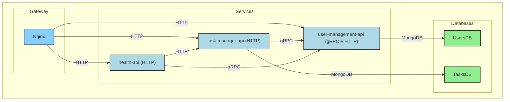

# go-microservices-demo
A lightweight **Go microservices** demo showcasing gRPC and HTTP communication, built on top of the [scv-go-tools](https://github.com/sergicanet9/scv-go-tools) library and using [go-hexagonal-api](https://github.com/sergicanet9/go-hexagonal-api) as a backend service.

## 🧩 System Components
| Component           | Role            |  Integration     | Description                                                                                                                                                            |
| ------------------- | --------------- | ---------------- |----------------------------------------------------------------------------------------------------------------------------------------------------------------------- |
| user-management-api | gRPC + REST API | Docker Container | Provides user management and JWT authentication + authorization. Integrated via Docker Image from [go-hexagonal-api](https://github.com/sergicanet9/go-hexagonal-api). |
| task-manager-api    | REST API        | Docker Container | Manages tasks for the logged in user. Authenticates user tokens and interacts with user-management-api via gRPC.                                                       |
| health-api          | REST API        | Docker Container | Performs a complete system health check by calling the health endpoints in user-management-api by gRPC and task-manager-api by HTTP.                                   |
| MongoDB             | Database        | Docker Container | Provides two different MongoDB databases to store users and tasks.                                                                                                     |
| Nginx               | HTTP Gateway    | Docker Container | Acts as an entrypoint for the distributed system, routing the HTTP traffic to the internal APIs.                                                                       |

## ⚙️ Other Components
| Component     | Role        | Integration        | Description                                                                                                                                             |
| ------------- | ----------- | ------------------ | ------------------------------------------------------------------------------------------------------------------------------------------------------- |
| common        | Shared code | Internal Go Module | HTTP and gRPC clients for inter-service communication.                                                                                                  |
| e2e tests     | Testing     | Internal Go Module | End-to-end tests validating interactions across the system components.                                                                                  |
| scv-go-tools  | Toolkit     | External Go Module | Toolkit for building REST and gRPC APIs. Integrated via external Go module from [scv-go-tools](https://github.com/sergicanet9/scv-go-tools).            |
| mongo-express | Utility     | Docker Container   | Web interface for MongoDB.                                                                                                                              |

## 📈 Architecture Diagram


## 🏁 Getting Started
### Run it with Docker
To start the entire application stack using Docker Compose, run:
```
make up
```
This command launches the Docker Images described above.
<br />
Check the console output for Swagger UI, gRPC UIs and HTTP command examples, all routed through the Nginx Gateway.
<br/>
The mongo-express URL is also displayed.

To stop and remove all containers, run:
```
make down
```

### Debug it with VS Code
The project includes debugging profiles in [launch.json](https://github.com/sergicanet9/go-microservices-demo/blob/main/.vscode/launch.json) for both task-manager-api and health-api. Simply select the desired configuration in the VS Code debugger and run it.

NOTES:
- The database and the other APIs need to be up and running (run `make up`).
- Configuration adjustments may be required to ensure full system integration while debugging one API locally.

## 📦 API Endpoints
All the APIs are exposed through the Nginx Gateway.

### health-api
| HTTP Endpoint               | Description                                   |
| --------------------------- | --------------------------------------------- |
| GET `/health-api/v1/health` | Returns the health status of all system APIs. |

### task-manager-api
These endpoints require a valid JWT issued by User Management API, formatted as `Bearer {token}` and included as `Authorization` header.
| HTTP Endpoint                            | Description                                    |
| ---------------------------------------- | ---------------------------------------------- |
| GET `/task-manager-api/v1/tasks`         | Gets all the tasks for the authenticated user. |
| POST `/task-manager-api/v1/tasks`        | Creates a new task for the authenticated user. |
| DELETE `/task-manager-api/v1/tasks/{id}` | Deletes a task for the authenticated user.     |

### user-management-api
Endpoints described in [go-hexagonal-api Endpoints](https://github.com/sergicanet9/go-hexagonal-api?tab=readme-ov-file#-api-endpoints).

## ✅ Testing
### Run all unit tests
```
make all-test-unit
```

### Run End-to-End tests
```
make test-e2e
```
<br />

 NOTES:
- The entire application stack needs to be up and running (run `make up`).

## 📚 References
* [scv-go-tools](https://github.com/sergicanet9/scv-go-tools)
* [go-hexagonal-api](https://github.com/sergicanet9/go-hexagonal-api)

## ✍️ Author
Sergi Canet Vela

## ⚖️ License
This project is licensed under the terms of the MIT license.
